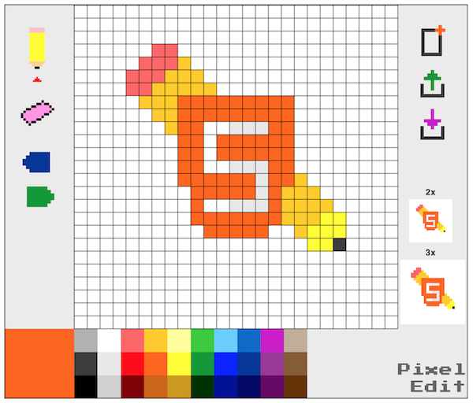

An html5 canvas pixel editor, for html5 canvas. Renders your pixel art as javascript objects. Easier and better than using pngs.

Usage
-----
Pretty straightforward (at the current version, at least!). Export button puts the js object you created in the debug console. You can render it using the `drawSpr(yourExportedObject, x, y, size)` if you would like to experiment or implement your art early.
